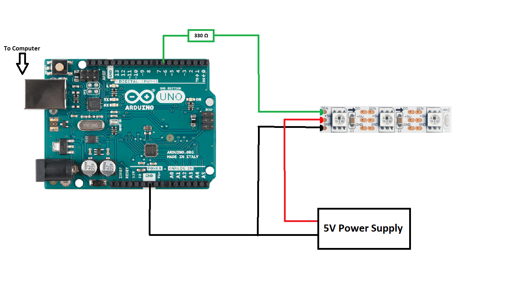

# LED Animation with Arduino and Processing

+ LED configurations and patterns for (main) living room, bed(room), and (spiral) stand
+ Different audio analysis methods to sync LED strip animations to music

## Hardware

+ Arduino Uno Rev3
+ WS2812B Led Strip
+ 5V Power Supplies

## Software 

+ Arduino IDE
+ Processing (https://processing.org/)

## Circuit Setup

